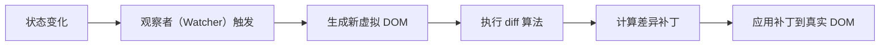

# 虚拟 DOM 的更新机制是否应用了观察者模式？请结合 diff 算法说明。

## meta 元数据


```
{

&#x20; "id": "d5e6f7g8-h9i0-1234-fghi-567890abcde2",

&#x20; "type": "answer",

&#x20; "difficulty": "difficult",

&#x20; "tags": \["设计模式"]

}
```

## 答案 1：核心简洁的口语化回答

・虚拟 DOM 更新机制间接应用了观察者模式思想，状态变化作为 "被观察事件"，视图更新作为 "观察者响应"

・框架通过观察者（如 React 的 useState/useEffect、Vue 的 watcher）监听状态变化，触发虚拟 DOM 重新生成

・diff 算法是更新机制的执行环节，负责高效计算虚拟 DOM 差异，不属于观察者模式，但依赖观察者模式触发

・核心关联：观察者模式解决 "状态变化如何通知视图"，diff 算法解决 "视图如何高效更新"，二者协同完成渲染流程

・区别：观察者模式侧重事件通知，diff 算法侧重差异计算，前者是触发条件，后者是执行逻辑

## 答案 2：口语化扩展回答

虚拟 DOM 的更新机制虽然没有直接照搬观察者模式的经典实现，但里面确实有观察者模式的影子。比如在 React 或 Vue 里，当组件的状态发生变化时，框架能自动知道要更新视图，这背后其实就是通过类似观察者的机制实现的 —— 状态是被观察的对象，而组件的渲染函数或者相关的更新函数就是观察者。

当状态变化时，观察者会被触发，这时框架会重新生成新的虚拟 DOM，然后用 diff 算法对比新旧虚拟 DOM 的差异。diff 算法的作用是找出哪些地方需要真正更新，这样就不用重新渲染整个页面，提高效率。这里的关键是，diff 算法本身不涉及观察逻辑，它只是在观察者发出 "需要更新" 的信号后，负责具体的差异计算工作。

举个例子，Vue 中的 watcher 会监听数据变化（相当于观察者），数据一变就触发更新，这时候就会进入虚拟 DOM 的 diff 阶段，计算出最小更新范围后再操作真实 DOM。所以说，观察者模式是触发更新的 "信号灯"，而 diff 算法是处理更新的 "执行者"，两者配合让虚拟 DOM 机制高效运行。

## 答案 3：技术深度解析

### 虚拟 DOM 更新机制与观察者模式的关联

虚拟 DOM 的更新机制**间接应用了观察者模式的设计思想**，但并非严格意义上的经典观察者模式实现。其核心关联体现在状态变化的监听与视图更新的触发链路中，而 diff 算法则是该链路中的关键执行环节，负责优化更新效率。

#### 1. 观察者模式的核心要素映射


| 观察者模式要素       | 虚拟 DOM 更新机制中的对应实现                                     |
| ------------- | ----------------------------------------------------- |
| 被观察者（Subject） | 组件的状态（如 React 的 state、Vue 的 data）                     |
| 观察者（Observer） | 组件的更新函数（如 React 的 render、Vue 的 updateComponent）       |
| 订阅关系          | 状态与组件的依赖关联（如 React 的 Fiber 节点依赖、Vue 的 Dep-Watcher 关联） |
| 通知机制          | 状态变化时触发的更新调度（如 React 的 scheduler、Vue 的 nextTick）      |

#### 2. 框架中的具体实现（以 Vue 为例）

Vue 通过 `Dep`（被观察者）和 `Watcher`（观察者）建立状态与视图的关联，当状态变化时，`Dep` 会通知所有依赖的 `Watcher` 执行更新，这一过程直接体现了观察者模式：


```
// 简化的 Dep 实现（被观察者）

class Dep {

&#x20; constructor() {

&#x20;   this.subs = \[]; // 存储观察者（Watcher）

&#x20; }

&#x20; addSub(sub) {

&#x20;   this.subs.push(sub); // 订阅

&#x20; }

&#x20; notify() {

&#x20;   this.subs.forEach(sub => sub.update()); // 状态变化时通知所有观察者

&#x20; }

}

// 简化的 Watcher 实现（观察者）

class Watcher {

&#x20; constructor(vm, updateFn) {

&#x20;   this.vm = vm;

&#x20;   this.updateFn = updateFn; // 视图更新函数（对应虚拟 DOM 生成逻辑）

&#x20; }

&#x20; update() {

&#x20;   // 触发虚拟 DOM 更新流程

&#x20;   this.vm.\_update(this.vm.\_render());

&#x20; }

}
```

### diff 算法在更新机制中的角色

diff 算法是虚拟 DOM 更新机制的**执行阶段**，负责计算新旧虚拟 DOM 树的差异并生成最小操作补丁，其本身不涉及观察者模式，但依赖观察者模式触发执行。

#### 1. 完整更新链路拆解





*   **观察者模式作用**：A→B 环节，解决 "状态变化如何通知视图更新" 的问题

*   **diff 算法作用**：C→E 环节，解决 "如何高效计算更新范围" 的问题

#### 2. diff 算法的执行逻辑（以 React 为例）

React 的 diff 算法基于 Fiber 架构，采用 "时间切片" 和 "优先级调度" 策略，其核心是通过对比虚拟 DOM 的 `type` 和 `key` 来定位差异：


```
// 简化的 React diff 逻辑

function reconcileChildren(oldFiber, newChildren) {

&#x20; let oldIndex = 0;

&#x20; let newIndex = 0;

&#x20; // 遍历新虚拟 DOM 节点

&#x20; while (oldIndex < oldFiber.children.length && newIndex < newChildren.length) {

&#x20;   const oldChild = oldFiber.children\[oldIndex];

&#x20;   const newChild = newChildren\[newIndex];

&#x20;  &#x20;

&#x20;   // 对比节点类型和 key

&#x20;   if (oldChild.type === newChild.type && oldChild.key === newChild.key) {

&#x20;     // 类型相同则复用节点，递归对比子节点

&#x20;     reconcileChildren(oldChild, newChild.children);

&#x20;     oldIndex++;

&#x20;     newIndex++;

&#x20;   } else {

&#x20;     // 类型不同则标记删除旧节点

&#x20;     markDeleted(oldChild);

&#x20;     oldIndex++;

&#x20;   }

&#x20; }

&#x20; // 处理剩余节点（新增或删除）

&#x20; while (newIndex < newChildren.length) {

&#x20;   markAdded(newChildren\[newIndex]);

&#x20;   newIndex++;

&#x20; }

&#x20; while (oldIndex < oldFiber.children.length) {

&#x20;   markDeleted(oldFiber.children\[oldIndex]);

&#x20;   oldIndex++;

&#x20; }

}
```

#### 3. 观察者模式与 diff 算法的协同关系


*   **触发关系**：观察者模式的通知机制（如 `Watcher.update`）是 diff 算法的启动器。没有状态变化的观察与通知，diff 算法不会主动执行。

*   **效率互补**：观察者模式确保仅依赖状态变化的组件被通知更新（精准触发），diff 算法确保仅变化的部分被更新（最小操作），二者共同实现高效渲染。

*   **职责分离**：观察者模式处理 "何时更新"，diff 算法处理 "如何更新"，符合单一职责原则。

### 关键差异：虚拟 DOM 更新机制 vs 经典观察者模式


1.  **耦合程度不同**：

*   经典观察者模式中，观察者与被观察者直接关联（如 `Dep.addSub`）

*   虚拟 DOM 机制中，状态与组件的关联通过框架内部机制隐式维护（如 React 的 Fiber 依赖链），开发者无需手动订阅 / 取消订阅

1.  **通知粒度不同**：

*   经典观察者模式通常是精确通知（指定观察者）

*   虚拟 DOM 机制中，状态变化可能触发组件树的批量更新（如 React 的批量更新策略），通知粒度更粗但通过 diff 算法弥补效率损失

1.  **副作用处理不同**：

*   经典观察者模式的更新逻辑由用户定义

*   虚拟 DOM 机制中，更新逻辑被框架标准化（生成虚拟 DOM → diff → 操作真实 DOM），开发者只需关注状态变化

### 实战案例：状态变化触发 diff 的完整流程

以 Vue 组件更新为例，展示观察者模式与 diff 算法的协同过程：


```
// 1. 组件初始化时，建立状态与 Watcher 的关联（订阅）

const vm = new Vue({

&#x20; data() { return { count: 0 }; },

&#x20; template: \`\<div>{{ count }}\</div>\`

});

// 2. 状态变化时，被观察者（count）通知 Watcher（观察者）

vm.count = 1; // 触发 setter → Dep.notify()

// 3. Watcher 触发更新，生成新虚拟 DOM

// vm.\_render() 生成新虚拟 DOM: { tag: 'div', children: '1' }

// 4. 执行 diff 算法对比新旧虚拟 DOM

function patch(oldVnode, newVnode) {

&#x20; if (oldVnode.tag !== newVnode.tag) {

&#x20;   replaceVnode(oldVnode, newVnode);

&#x20; } else {

&#x20;   // 标签相同则对比内容

&#x20;   if (oldVnode.text !== newVnode.text) {

&#x20;     updateTextContent(oldVnode.elm, newVnode.text); // 仅更新文本内容

&#x20;   }

&#x20; }

}

// 5. 应用差异到真实 DOM，完成更新
```

在该流程中：


*   步骤 1-2 体现观察者模式（状态变化通知更新）

*   步骤 3-5 体现 diff 算法的作用（高效计算并应用差异）

### 结论

虚拟 DOM 的更新机制**借鉴了观察者模式的核心思想**（状态作为被观察者，视图更新作为观察者响应），但通过框架内部机制实现了更高层次的抽象与自动化。diff 算法作为更新机制的关键环节，不直接属于观察者模式，但依赖观察者模式触发执行，二者共同构成了现代前端框架的高效渲染体系：


*   观察者模式解决了 "状态变化如何传递到视图" 的问题，是更新的触发者

*   diff 算法解决了 "视图如何高效更新" 的问题，是更新的执行者

这种设计既保留了观察者模式的解耦优势，又通过 diff 算法的优化降低了频繁更新的性能开销，成为 React、Vue 等框架的核心竞争力之一。

