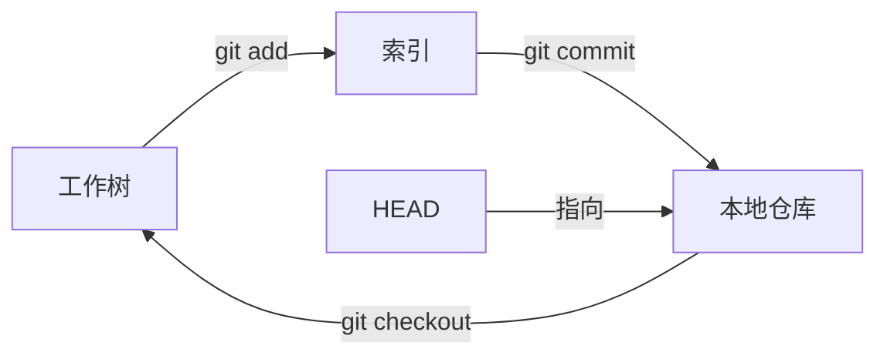

# 说说 Git 中 HEAD、工作树和索引之间的区别？

## meta 元数据


```
{

&#x20; "id": "f5g6h7i8-j9k0-1234-lmno-5678901234ef",

&#x20; "type": "answer",

&#x20; "difficulty": "medium",

&#x20; "tags": \["版本管理"]

}
```

## 答案 1：核心简洁的口语化回答

• **HEAD**：是一个指针，指向当前正在工作的分支或提交，标记着当前版本的位置。

・**工作树**：就是电脑里能看到的项目文件目录，是实际编辑代码的地方，包含当前修改的内容。

・**索引**：也叫暂存区，是工作树和本地仓库之间的中间区域，临时存放准备提交的修改，相当于提交前的 “待办清单”。

## 答案 2：口语化扩展回答

HEAD 就像个路标，告诉你现在正在哪个版本上工作。平时它指向当前分支的最新提交，比如在 main 分支时，HEAD 就指着 main 分支的最后一次提交；如果切换到其他分支，它就跟着指向那个分支的最新提交。要是用`git checkout`切换到某个具体的提交，HEAD 就会直接指向那个提交，进入 “分离头指针” 状态。

工作树就是我们实际操作的文件集合，比如打开编辑器修改的代码文件、新增的图片等，都在工作树里。这些文件的状态可能是未修改、已修改但没处理，或者是新添加还没被 Git 跟踪的。工作树里的内容是实时变动的，直到被提交到仓库。

索引则是个中间过渡区域，当我们用`git add`命令时，就是把工作树里的修改复制到索引中。它像个缓冲区，让我们可以先把要提交的修改集中起来，检查没问题后，再用`git commit`一次性提交到本地仓库。这样就不用每次改一点就提交，能灵活控制提交的内容范围。

简单说，工作树是编辑区，索引是待提交区，HEAD 是当前版本的标记，三者分工不同却又相互关联，共同构成了 Git 的基本工作流程。

## 答案 3：技术深度解析

### 核心定义与技术本质

#### 1. HEAD


*   **本质**：HEAD 是一个存储在`.git/HEAD`的文本文件，内容为当前指向的引用（分支或提交哈希）

*   **作用**：标记 Git 当前操作的基准版本，所有工作都是基于 HEAD 指向的版本进行的

*   **存储格式示例**：


```
\# 指向分支时（通常状态）

cat .git/HEAD  # 输出：ref: refs/heads/main

\# 指向具体提交时（分离头指针状态）

cat .git/HEAD  # 输出：a1b2c3d4e5f67890abcdef1234567890abcdef12
```

#### 2. 工作树（Working Tree）


*   **本质**：是用户可见的文件系统目录，包含从 Git 仓库检出的文件副本及新增 / 修改的内容

*   **特性**：


    *   与 Git 仓库（.git 目录）分离，是独立的文件系统结构

    *   包含三种状态的文件：


        *   未跟踪（Untracked）：新文件，未被`git add`过

        *   已跟踪未修改（Unmodified）：在仓库中存在，未被修改

        *   已跟踪已修改（Modified）：在仓库中存在，已被修改但未暂存

#### 3. 索引（Index）


*   **本质**：也称为暂存区，是存储在`.git/index`的二进制文件，记录了即将提交的文件快照信息

*   **作用**：作为工作树与本地仓库之间的缓存层，定义了下一次提交（commit）的内容

*   **存储内容**：包含文件名、文件权限、SHA-1 哈希（指向 blob 对象）、时间戳等元数据

### 数据流转关系

三者通过 Git 命令形成清晰的数据流：





*   **工作树 → 索引**：`git add`命令将工作树中修改的文件快照写入索引

*   **索引 → 本地仓库**：`git commit`命令将索引中的内容生成提交对象，添加到仓库

*   **本地仓库 → 工作树**：`git checkout`命令将 HEAD 指向的版本检出到工作树

*   **HEAD 与仓库**：HEAD 始终指向仓库中的某个提交（当前分支的最新提交或特定提交）

### 状态转换示例

以修改文件`index.js`为例，展示三者的状态变化：


1.  **初始状态**：

*   工作树：`index.js`与 HEAD 指向的版本一致

*   索引：包含`index.js`的当前快照（与工作树一致）

*   HEAD：指向`main`分支的最新提交`c1`

1.  **修改工作树**：

*   编辑`index.js`后保存

*   工作树：`index.js`处于**已修改**状态

*   索引：仍保留修改前的快照（与 HEAD 一致）

*   此时`git status`显示`index.js`为红色（未暂存）

1.  **添加到索引**：

*   执行`git add index.js`

*   工作树：`index.js`仍为修改后状态（内容不变）

*   索引：更新为`index.js`的最新快照（与工作树一致）

*   此时`git status`显示`index.js`为绿色（已暂存）

1.  **提交到仓库**：

*   执行`git commit -m "modify index.js"`

*   本地仓库：创建新提交`c2`，父提交为`c1`

*   HEAD：自动向前移动，指向新提交`c2`

*   索引：清空已提交内容（准备接收新的暂存）

*   工作树：内容不变，但已与 HEAD 指向的版本一致

### 底层文件结构对比


| 组件   | 存储位置           | 文件格式   | 核心数据内容                             |
| ---- | -------------- | ------ | ---------------------------------- |
| HEAD | `.git/HEAD`    | 文本文件   | 引用路径（如`ref: refs/heads/main`）或提交哈希 |
| 工作树  | 仓库根目录（除.git 外） | 实际文件格式 | 可编辑的文件内容                           |
| 索引   | `.git/index`   | 二进制文件  | 文件名、权限、blob 哈希、时间戳等                |

### 特殊场景解析


1.  **分离头指针（Detached HEAD）**：

*   当`git checkout <commit-hash>`时，HEAD 直接指向具体提交而非分支

*   此时在工作树的修改仍可通过`git add`和`git commit`创建新提交，但不会更新任何分支

*   若切换回分支，这些提交可能会丢失（需通过`git reflog`找回）

1.  **索引的高级用法**：

*   部分暂存：`git add -p`可交互式选择文件的部分修改添加到索引

*   撤销暂存：`git restore --staged index.js`将索引中`index.js`的快照恢复为 HEAD 版本

*   索引与工作树比较：`git diff --cached`查看索引与 HEAD 的差异

1.  **多个工作树**：

*   通过`git worktree`命令可创建多个工作树，共享同一个仓库

*   每个工作树有独立的 HEAD 指针（可指向不同分支），但共享索引和仓库数据

### 总结：三者的核心区别


| 维度     | HEAD             | 工作树                 | 索引                    |
| ------ | ---------------- | ------------------- | --------------------- |
| 形态     | 指针（引用）           | 文件系统目录              | 二进制缓存文件               |
| 可编辑性   | 不可直接编辑（通过命令间接修改） | 可直接编辑（通过编辑器 / 操作系统） | 不可直接编辑（通过`git add`修改） |
| 与提交的关系 | 标记当前提交位置         | 包含可能未提交的修改          | 定义下一次提交的内容            |
| 核心作用   | 定位当前版本基准         | 提供文件编辑环境            | 控制提交内容范围              |

理解 HEAD、工作树和索引的区别，是掌握 Git 工作原理的关键。它们通过分工协作，既保证了代码编辑的灵活性，又实现了版本控制的严谨性，让开发者能安全、高效地管理代码变更。

